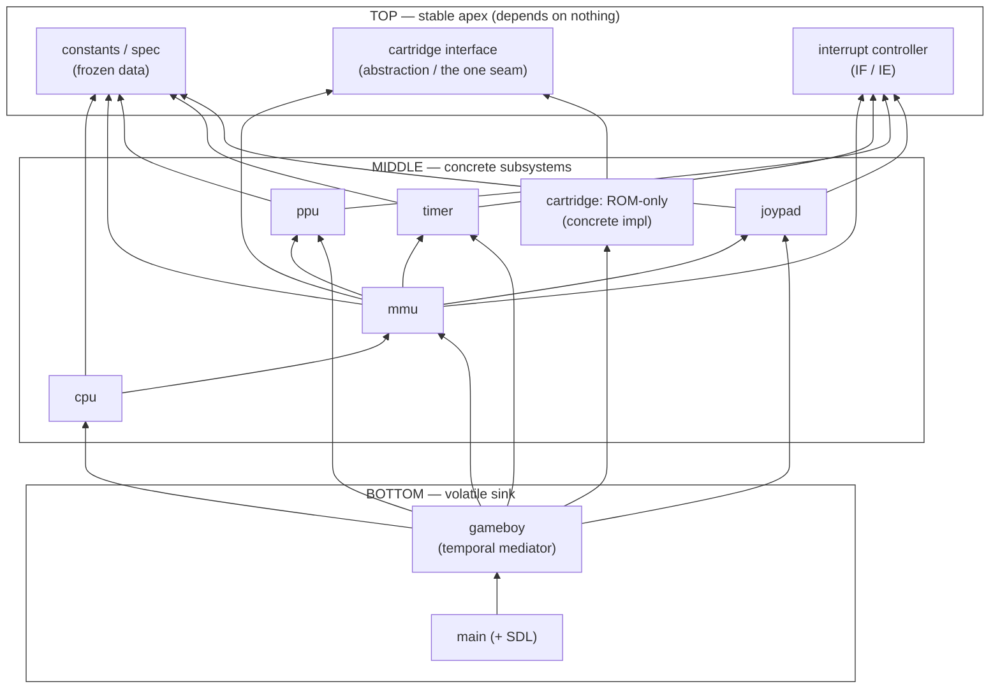
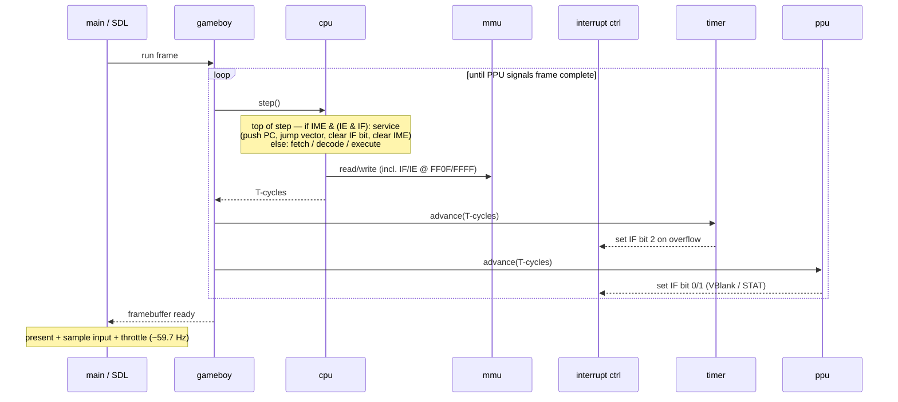

# ARCHITECTURE.md

The structural view of the emulator. This is the **stable** artifact — reviewed weekly, and
if it changes more than that, something below its altitude leaked in (see "What this is NOT",
bottom). Implementation choices live in `DESIGN.md`; reference constants live in `TECH.md`.

---

## The organizing axis: stability, not control

The vertical axis of this document is **dependency stability**, deliberately *not* control
flow. A module is "higher" the more it is depended upon and the less it depends on others.

This is the Dependency Inversion Principle plus the Stable Dependencies Principle ("depend in
the direction of stability") and the Stable Abstractions Principle ("stable things should be
abstract"). Two consequences to keep front-of-mind:

- **All source-code dependency arrows point UP**, toward the stable apex. The apex depends on
  nothing beneath it.
- **Control flow points DOWN.** The orchestrator drives everything below it, yet *depends on*
  everything below it — so it sits at the BOTTOM of this axis, not the top. Being "in charge"
  (control) is not the same as being "depended upon" (stability). DIP is precisely the trick
  of making these two point in opposite directions.

> Why stability and not policy-vs-detail? For normal apps those axes mostly coincide. For an
> emulator of **fixed hardware** they actively disagree: hardware constants are the most
> *frozen* thing here, yet in classic layering "hardware/devices" are the archetypal volatile
> *detail*. We choose stability as the axis and own the consequence — frozen hardware facts
> sit at the TOP.

---

## The layers

### TOP — the stable apex (depends on nothing)
**Three** *different* kinds of stability live here; keep them as distinct nodes, they behave
differently on the diagram. The unifying rule: a node belongs at TOP only if it **depends on
nothing beneath it.**

- **Frozen foundation (concrete shared data).** The hardware spec as data: memory-map ranges,
  I/O register addresses, interrupt vectors, bit masks. Stable because it is *frozen by spec*.
  Everyone reads it; it implements nothing. (This is `TECH.md` rendered as a constants module.)
- **Stable abstraction (the one real seam).** The cartridge `read`/`write` interface. Stable
  because it is *abstract*: the volatile concretes (ROM-only now; MBC1/3/5 later) depend UP on
  it. This is the project's single legitimate Dependency-Inversion boundary (per `DESIGN.md`
  principle #4 — abstract only where it earns its cost; here it does, nowhere else does).
- **Interrupt controller (stateful, stable *interface*).** The `IF`/`IE` state plus a small
  contract: raise a source, query/clear pending, gate by enable. Stable not because it is
  frozen (its bits change every frame) and not because it is abstract, but because its
  **interface never changes**. It depends on nothing in MIDDLE, so timer/ppu/joypad can each
  depend UP on it to *raise* interrupts and the cpu can depend on it to *read* them — without
  any of them depending on each other. This is what breaks the would-be sideways coupling
  between the interrupt sources. (Note: it is *stateful*, unlike the other two TOP citizens —
  do not let that turn TOP into a junk drawer; the bar for entry is still "depends on nothing.")

### MIDDLE — the concrete subsystems
`cpu`, `mmu`, `ppu`, `timer`, `joypad`. Each is **flat and concrete** — no inversion, no
interface (the cartridge is the lone exception above). They depend UP on the frozen foundation
and on the interrupt controller, and they communicate *only through a mediator* (see below) —
never directly with one another. This layer is where the hardware is faithfully transcribed;
faithfulness beats cleverness.

> **Why the `mmu` is concrete and lives here, not at TOP as an abstraction.** Its read/write
> *contract* is apex-stable, but the *module* is the highest-fan-out hub in the system — it
> depends on the cartridge, every device, and the interrupt controller in order to route to
> them. TOP is defined as "depends on nothing"; a hub that depends on everything it routes to
> cannot sit there. And a polymorphic seam would buy nothing: there is exactly one DMG bus,
> forever (one implementation), and it is the hottest path in the program. Rationale logged in
> `DESIGN.md`. (Stable *contract* ≠ must-be-*abstract*.)

### The two mediators
Middle modules never talk to each other directly — that coupling is exactly what we avoid. But
they cannot be fully isolated either, so communication is funneled through **two** mediators,
split by the *kind* of communication (this split is dictated by the hardware, not a choice):

- **`mmu` — the data-bus mediator.** Synchronous, address-based, constant (several accesses per
  instruction). The cpu reads/writes an address; the mmu routes it to the right device. The cpu
  thus never knows any device exists — the mmu *is* the decoupling mechanism for memory-mapped
  traffic. The `cpu → mmu` edge is the one sanctioned middle→middle "spine" edge.
- **`gameboy` — the temporal mediator.** Advances every subsystem by the cpu's returned cycle
  count and runs the frame loop. It mediates *time*, not data — which is why it cannot absorb
  the mmu's job (it cannot sit on the bus for every memory access).

Interrupts need *neither* mediator: a source raises a bit in the TOP interrupt controller, the
cpu reads it on its next step. Source and cpu stay mutually ignorant — the shared TOP node is
the whole mechanism, with zero `gameboy` involvement.

### BOTTOM — the volatile sink
`gameboy` (the orchestrator / run loop) and `main` (process entry + SDL). Depends on
everything above; depended upon by almost nothing. Highest churn, lowest stability — correctly
at the bottom of a stability axis even though it holds all the control flow.

---

## Module placement & edges

Two views, kept separate on purpose — conflating dependency and control flow is what makes a
diagram churn.

### View 1 — Dependency / stability

The vertical axis is **stability**. **Every arrow is a source-code dependency and points UP**
toward the stable apex; the apex depends on nothing. (Control flow runs the opposite way — see
View 2.) The single lateral edge, `cpu → mmu`, is the sanctioned data-bus spine.

### View 2 — Control / data flow (the per-frame run loop)

Instruction-stepped catch-up. Note the directions are *reversed* from View 1: `gameboy` drives
**down** into the subsystems, and interrupts flow through the `IF` mailbox (a source sets a bit
during its advance; the cpu collects it at the top of the **next** step — the *i → i+1* latency).

**Legend.** View 1 arrow = compile-time "depends on / knows about" (points toward stability).
View 2 arrow = runtime call/data (points along control flow). The two pointing opposite ways is
DIP working as intended.

### Decisions

1. **Who owns `IF` / `IE`?** — **RESOLVED.** A dedicated **interrupt controller at TOP** (see
   that node above). Sources depend up on it to raise; the cpu depends on it to read. This
   keeps the interrupt sources mutually decoupled and introduces no sideways edges. Log the ADR
   in `DESIGN.md`.

   - **Sub-question — RESOLVED:** the cpu reaches `IF`/`IE` *through the mmu* (they are
     memory-mapped at `FF0F`/`FFFF`, routed like any other address), preserving the mmu as the
     cpu's single outward dependency. The interrupt controller stays a TOP node that
     timer/ppu/joypad depend on to *raise*. ADR in `DESIGN.md`.

2. **How does `mmu` reach `ppu`/`timer`/`joypad`?** — **RESOLVED: concrete (option A).** The mmu
   holds distinct typed members (`ppu`, `timer`, `joypad`) and calls their non-virtual public
   accessors directly — no device abstraction. The `mmu → device` edges are one-way lateral
   **spine** edges: the mmu (mediator) knows the devices; **devices never depend back on the
   mmu**. That one-way property is guaranteed by ownership — **each device owns its own
   memory-mapped state** (the ppu owns VRAM/OAM, the timer owns its counters, etc.), so it
   reads its own state directly and never calls back into the mmu.
   - *OAM DMA* (`FF46`) is the edge case: keep the copy on the mmu/mediator side so the arrow
     stays `mmu → ppu`, never `ppu → mmu`.
   - **Why concrete, not a seam:** the change profile is shallow — ≈one known memory-mapped
     addition (the APU, v2), accommodated by a one-line routing branch, and the refactor to a
     seam later is cheap and reversible. A device interface would pay recurring hot-path cost
     for a single shallow axis of change. Full rationale + **revisit trigger** (2nd/3rd mapped
     device) in `DESIGN.md`. Contrast the cartridge: many *deep behavioral* variants → it earns
     the seam; device-routing is few + additive → it does not.

---

## Architecture review log

Append a row each weekly review. A mid-week change is a signal the diagram drifted below its
altitude — record *what leaked* and push it down into `DESIGN.md`, don't just patch the box.

| Date | Change | Why (which boundary/edge moved) | Altitude check |
|---|---|---|---|
| | | | |

---

## What this is NOT (altitude guard)

The following are **interiors** — they change inside a normal coding day and belong in
`DESIGN.md`, never here:

- CPU opcode dispatch: `switch` vs. handler table.
- Register pairing: union vs. explicit accessors.
- PPU rendering: scanline vs. pixel-FIFO.
- Any specific register offset or bit layout (that is `TECH.md`).

The diagram shows *that* the CPU dispatches opcodes and *that* it reads through the MMU — never
*how*. If an edit to this file is really an edit to an interior, it goes in the other two docs.
